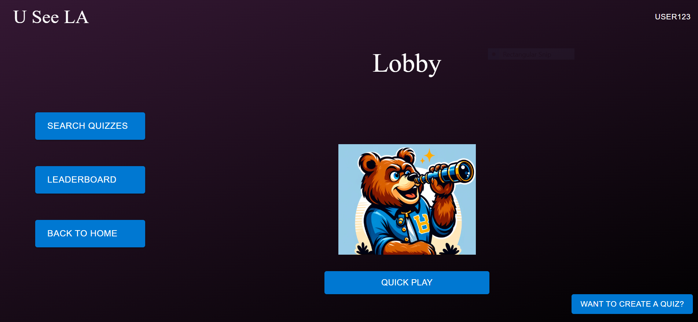
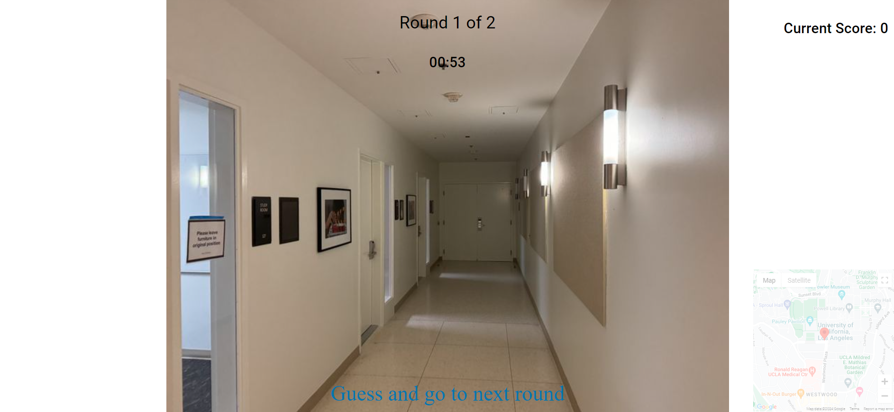
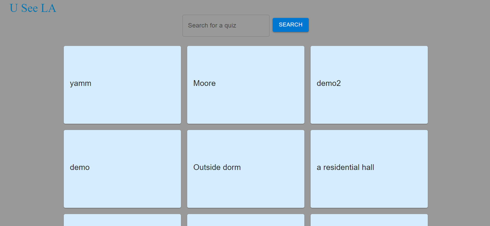

# UCLA Geoguesser

Welcome to UCLA Geoguesser, an engaging game where you're presented with multiple photos of locations on campus, and it's your task to guess their whereabouts.

## Preview
#### Lobby

#### Playing the game

#### Leaderboard

#### Searching specifc quizzes

#### Uploading your own quizzes

## How to Contribute

Visit the [Dev page](./dev.md) to learn how you can contribute to this exciting project.

## How to Run

1. Copy the .env file into the root folder to access the necessary keys for our backend and Google Maps API.
   - If you aren't a member of our project you can try messaging one of the contributors for the .env file or you won't be able to run.
2. Run `make all` in your terminal. This command performs the following tasks:
   - Installs all required packages
   - Kills any previous Node processes
   - Starts the backend and then the frontend
   - Inserts the API key into the correct file before launching the frontend

   Note: If packages are already up to date, the makefile won't reinstall them.

3. Upon running, a sign-in screen will prompt you if you don't have a cookie for the game.
4. Sign up if you're new or sign in if you already have an account. Future visits will automatically sign you in with cookies.
5. Explore the lobby, make a game, play, search, view the leaderboard, or check your profile. The possibilities are endless!

Enjoy your time with UCLA Geoguesser!

### Quick notes

**Bug we have noticed:**
 *   If running the web app from certain places on campus with restricted internet, the dev server (frontend) won't properly launch. Other groups had similar issues.
 *   Running from anywhere on the hill and some libraries work fine.

**It runs on the following machines:**
  *  Arch Linux
  *  Mac
  *  Ubuntu
  *  Windows 10

Please bear with the huge dependency list, we went through quite a few frontend iterations.

## Architecture

### Backend

Our backend relies on MongoDB, with the server.js file handling all operations. Key components include:

- **Routes**: Described in the routes folder, these routes direct backend requests to api/path/to/backend/feature.
- **Controllers**: Implementing various HTTP requests such as PATCH, POST, DELETE, etc.
- **Models**: Representing MongoDB backend models (schemas) stored on MongoDB.

#### Schema Design

- **Quiz**
  - Quiz information
  - Lookup table for images
- **Lookup**
  - Holds image IDs for convenient lookup
- **Image**
  - Stores image details
- **User**
  - User information
  - Contains all user quizzes
  - Maintains the user's current score

### Frontend

The frontend, orchestrated through index.js, ensures smooth routing. Key features include:

- **App.js**: The root of the app, directing users to the login page.
- **Login Page**: Bypasses itself with cookies; otherwise, users must log in or sign up.

#### Frontend Interaction with Backend

- **game.js**
  - Fetches quiz info from the backend
  - Sends the score back to the user (stored in local storage)
- **imageUpload.js** (quiz creation)
  - Uploads images to the backend
  - Updates the user's quizzes with the added quiz
- **leaderboard.js**
  - Fetches all users, sorted by score
- **Login.js**
  - Utilizes a POST request to check the database for matching email and password, authenticates if successful, and initializes the localStorage user object.
- **Signup.js**
  - Utilizes a POST request to create a new user if the email is not already in the database.
- **lookForQuiz.js**
  - Fetches all quizzes and filters them based on the user's search (regex)
- **profile.js**
  - Fetches the user from the backend
